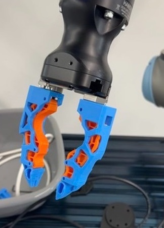

# Open-ENPIRE-Gripper-NVIDIA

<div align="center">

[](https://opensource.org/licenses/Apache-2.0)
[](https://makerworld.com/en/models/2984746-gripper-finger-for-robot-arm)
[](https://makerworld.com/en/models/2984746-gripper-finger-for-robot-arm#profileId-3349177)
[](https://research.nvidia.com/labs/gear/enpire/)
[](https://twitter.com/DrJimFan)
[](docs/3D_PRINTING_GUIDE.md)

**Democratizing the NVIDIA GEAR ENPIRE gripper design for generalist robotic arms.**

<p align="center">
  
  <br>
  <em>Physical hardware: ENPIRE high-friction compliant finger adapters mounted on a Robotiq Hand-E parallel gripper with wrist perception.</em>
</p>

[Video & Research](#-nvidia-gear-enpire-research--video) • [The Story](#-the-story--mission) • [Robotiq Hand-E Design](#-robotiq-hand-e-adapter-design) • [Compatibility Heatmap](#-robot-compatibility-heatmap) • [Printing Instructions](#-printing-instructions-for-best-results) • [Contributing](#-rules-for-contributing)

</div>

---

## 🎬 NVIDIA GEAR ENPIRE Research & Video

This project builds upon the groundbreaking research **ENPIRE: Agentic Robot Policy Self-Improvement in the Real World**, developed by the **NVIDIA GEAR** lab led by **Dr. Jim Fan** ([@DrJimFan](https://twitter.com/DrJimFan)) and **Dr. Yuke Zhu**.

<div align="center">

[](https://research.nvidia.com/labs/gear/enpire/)

*🔗 **Official Project Website & Video Demos**: [research.nvidia.com/labs/gear/enpire](https://research.nvidia.com/labs/gear/enpire/)*

</div>

```
       ┌─────────────────────────────────────────────────────────────┐
       │             NVIDIA GEAR Lab: Project ENPIRE                 │
       │     Agentic Robot Policy Self-Improvement in the Real World │
       └──────────────────────────────┬──────────────────────────────┘
                                      │
    ┌─────────────────────────────────┼─────────────────────────────────┐
    ▼                                 ▼                                 ▼
[ Autonomous AI Agents ]       [ Closed-Loop Feedback ]   [ Extreme Contact Dexterity ]
  Literature Search & Code       Physical Self-Correction    Zip-Ties, GPUs, Precision Micro-Sorting
```

### 📺 Research Highlights
* **Autonomous Policy Improvement**: LLM coding agents write robot policies, run physical trials, inspect video logs, and autonomously self-improve manipulation skills without human intervention.
* **99% Success on Extreme Tasks**: Leveraging high-friction compliant finger tips, robots mastered demanding contact tasks including **threading cable zip-ties, seating GPU/PCIe boards into motherboards, and micro-pin sorting**.
* **24/7 Self-Resetting Loops**: Robots recover and reset their own environments after failed trials for uninterrupted continuous learning.

> *"The bottleneck in robot learning has always been human babysitting. ENPIRE demonstrates that AI agents can run end-to-end robotics research in the physical world—writing code, debugging runs, and self-improving physical manipulation."*  
> — **Dr. Jim Fan** ([@DrJimFan](https://twitter.com/DrJimFan)), Director of AI / Embodied AI at NVIDIA

---

## 📖 The Story & Mission

### The Problem
The original ENPIRE research demonstrated the immense power of high-friction fingertip geometry, created by **Wenli Xiao** (CMU & NVIDIA GEAR) for the **I2RT YAM** arm. 

However, very few roboticists have access to an I2RT YAM arm. Most of the robotics community builds on **generalist robotic arms** and industry-standard parallel grippers: **Robotiq Hand-E, ALOHA, Open Arm, AgileX Piper, Seeed Studio reBot, Franka Panda, and ARX5**.

### The Mission
**Great robotics hardware should belong to everyone.** This project adapts the proven ENPIRE contact geometry into modular 3D-printable STL models for generalist arms—starting with our custom **Robotiq Hand-E** adapter—so anyone with a 3D printer can achieve frontier physical AI grasping.

*Original MakerWorld Model: [Gripper Finger for Robot Arm](https://makerworld.com/en/models/2984746-gripper-finger-for-robot-arm) / [Profile #3349177](https://makerworld.com/en/models/2984746-gripper-finger-for-robot-arm#profileId-3349177) by Wenli Xiao.*

---

## 🦾 Robotiq Hand-E Adapter Design

Our primary contribution adapts the ENPIRE fingertip geometry to the **Robotiq Hand-E** precision parallel electric gripper:

<div align="center">
  
</div>

```
                  ◄──────────── 50 mm Parallel Stroke ────────────►
             ┌─────────────────┐                       ┌─────────────────┐
             │  Left Finger    │                       │  Right Finger   │
             │                 │                       │                 │
             │  ┌───────────┐  │                       │  ┌───────────┐  │
             │  │ Ribbed    │  │ ◄─── High Friction ──►│  │ Ribbed    │  │
             │  │ Grip Face │  │      Contact Zone     │  │ Grip Face │  │
             │  │ (TPU/CF)  │  │      (μ > 0.8)        │  │ (TPU/CF)  │  │
             │  └───────────┘  │                       │  └───────────┘  │
             │                 │                       │                 │
             │  (M4 Counter-   │                       │  (M4 Counter-   │
             │   bore Holes)   │                       │   bore Holes)   │
             └────────┬────────┘                       └────────┬────────┘
                      │                                         │
        ┌─────────────┴─────────────────────────────────────────┴─────────────┐
        │                 Robotiq Hand-E Gripper Chassis                     │
        └──────────────────────────────────┬──────────────────────────────────┘
                                           │
                                  [ Robot Wrist Flange ]
```

### Design Specifications
* **Target Directory**: [`stl/hand_e_stl/`](stl/hand_e_stl/)
* **Mounting Standard**: 2× M4 / M3 socket head cap screws per finger (standard Robotiq bracket)
* **Stroke & Force**: 50 mm parallel stroke | 20 N to 130 N programmable grip force
* **Contact Surface**: Dual-material structural beam with integrated anti-slip compliant friction inserts

---

## 🔥 Robot Compatibility Heatmap

| Robot Platform | Arm Type | Status | Precision | Bimanual Support | High-Force Grip | Ease of 3D Print | Target STL Folder |
| :--- | :--- | :---: | :---: | :---: | :---: | :---: | :--- |
| **Robotiq Hand-E** | Precision Electric Gripper | 🟢 **Active** | 🟢 High | 🟢 Full | 🟢 130 N | 🟢 Easy | [`stl/hand_e_stl/`](stl/hand_e_stl/) |
| **ALOHA / Mobile ALOHA** | Bimanual Imitation Rig | 🟡 *In Progress* | 🟢 High | 🟢 Dual | 🟡 40 N | 🟢 Easy | [`stl/aloha_stl/`](stl/aloha_stl/) |
| **Open Arm** | Open-Source Robotic Arm | 🟡 *In Progress* | 🟡 Med | 🟡 Dual | 🟡 35 N | 🟢 Easy | [`stl/open_arm_stl/`](stl/open_arm_stl/) |
| **AgileX (Piper)** | Lightweight Bimanual Arm | 🟡 *In Progress* | 🟢 High | 🟢 Dual | 🟡 35 N | 🟢 Easy | [`stl/agilex_stl/`](stl/agilex_stl/) |
| **Seeed Studio reBot** | AI Robotic Arm | 🟡 *In Progress* | 🟡 Med | 🟡 Dual | 🟡 25 N | 🟢 Easy | [`stl/seeed_rebot_stl/`](stl/seeed_rebot_stl/) |
| **Robotiq 2F-85 / 2F-140** | Industrial Cobot Gripper | 🟡 *In Progress* | 🟢 High | 🟡 Single | 🟢 235 N | 🟢 Easy | [`stl/robotiq_2f85_2f140_stl/`](stl/robotiq_2f85_2f140_stl/) |
| **Franka Panda / FR3** | 7-DoF AI Research Cobot | 🟡 *In Progress* | 🟢 High | 🟡 Single | 🟢 70 N | 🟢 Easy | [`stl/franka_panda_stl/`](stl/franka_panda_stl/) |
| **ARX5** | Bimanual Research Arm | 🟡 *In Progress* | 🟢 High | 🟢 Dual | 🟡 40 N | 🟢 Easy | [`stl/arx5_stl/`](stl/arx5_stl/) |
| **I2RT YAM** | AI Research Arm | 🟢 *Original* | 🟢 High | 🟢 Dual | 🟡 45 N | 🟢 Easy | [`stl/enpire_i2rt_yam_stl/`](stl/enpire_i2rt_yam_stl/) |
| **ISO 9409-1 (UR / xArm)** | Universal Tool Flanges | 🟡 *In Progress* | 🟢 High | 🟡 Single | 🟢 150 N | 🟢 Easy | [`stl/iso_flange_adapters_stl/`](stl/iso_flange_adapters_stl/) |

*Legend: 🟢 Excellent / Available &nbsp;|&nbsp; 🟡 Moderate / Community Slot &nbsp;|&nbsp; 🔵 Planned*

---

## 📁 Repository STL Ecosystem

```
Open-ENPIRE-Gripper-NVIDIA/
├── stl/
│   ├── hand_e_stl/                 # 🌟 Robotiq Hand-E ENPIRE adapter STLs (Main target)
│   ├── agilex_stl/                 # AgileX (Piper) bimanual robot arm STLs
│   ├── aloha_stl/                  # ALOHA & Mobile ALOHA bimanual gripper STLs
│   ├── open_arm_stl/               # Open Arm robotics platform STLs
│   ├── seeed_rebot_stl/            # Seeed Studio reBot AI robotic arm STLs
│   ├── robotiq_2f85_2f140_stl/     # Robotiq 2F-85 and 2F-140 bracket STLs
│   ├── franka_panda_stl/           # Franka Emika Panda / FR3 dovetail slider STLs
│   ├── arx5_stl/                   # ARX5 bimanual robotic arm STLs
│   ├── enpire_i2rt_yam_stl/        # I2RT YAM baseline finger STLs (Wenli Xiao original)
│   ├── iso_flange_adapters_stl/    # Universal ISO 9409-1 (UR3e/5e/10e, xArm) flange plates
│   └── accessories_and_pads_stl/   # TPU friction snap-pads & silicone casting molds
├── docs/
│   ├── images/                     # Hardware photos & diagrams
│   ├── 3D_PRINTING_GUIDE.md        # Slicer profiles, layer heights, materials
│   └── ROBOT_COMPATIBILITY.md      # Dimensional specs and mounting standards
├── scripts/
│   └── validate_mesh.py            # Automated STL watertightness & bounding box validator
├── CONTRIBUTING.md                 # Rules for contributing STL files
└── README.md
```

---

## 🖨️ Printing Instructions for Best Results

### 1. Print Orientation (CRITICAL)
```
      ✅ CORRECT: Print flat on lateral side (Layer lines parallel to tension)
      ┌──────────────────────────────────────────────────────────┐
      │  Base Mount  =================> Structural Fingertip     │
      └──────────────────────────────────────────────────────────┘
      ════════════════════════════════════════════════════════════ (Build Plate)

      ❌ WRONG: Print standing vertically (Shear force snaps layer lines)
```

### 2. Slicer Settings (Bambu Studio / PrusaSlicer / OrcaSlicer)

| Setting | Structural Finger Body | Flexible Friction Pad |
| :--- | :--- | :--- |
| **Filament** | **PETG-CF / PLA-CF / PA12-CF** | **TPU 85A or TPU 95A** |
| **Layer Height** | **0.16 mm** (or 0.20 mm) | **0.16 mm** |
| **Wall Loops / Perimeters** | **5 to 6 walls** (Critical for strength) | **4 walls** |
| **Top / Bottom Solid Layers** | 5 Top, 5 Bottom | 4 Top, 4 Bottom |
| **Infill Density & Pattern** | **50% Gyroid or Cubic** | **40% Gyroid** |
| **Supports** | Tree supports (45° threshold) | None |

### 3. Assembly Tips
* **Heat-Set Inserts**: Set soldering iron to **230°C** for PETG/PLA or **275°C** for PA-CF. Press M3/M4 inserts until flush.
* **Fasteners**: Use ISO 4762 Grade 12.9 M3/M4 socket head cap screws with medium blue threadlocker (Loctite 243).

---

## 📋 Rules for Contributing

1. **Watertight Mesh**: Export binary STL files in **Millimeters (mm)** with zero non-manifold edges. Verify using:
   ```bash
   python3 scripts/validate_mesh.py
   ```
2. **Standard Orientation**: Coordinate frames must align ($+Z$ finger length, $+Y$ inward contact face). Export oriented flat on its side.
3. **Physical Test Print Required**: You must physically print the part and verify full stroke closure without binding before submitting a PR.
4. **PR Checklist**: Attach clear photos of the 3D-printed part installed on your robot arm and list your slicer settings.

*See [CONTRIBUTING.md](CONTRIBUTING.md) for full guidelines.*

---

## 📚 Citation & Attribution

```bibtex
@article{xiao2024enpire,
  title={ENPIRE: Agentic Robot Policy Self-Improvement in the Real World},
  author={Xiao, Wenli and Fan, Linxi and Zhu, Yuke and GEAR Lab and Collaborators},
  journal={arXiv preprint},
  year={2024}
}
```

*Foundational design by **Wenli Xiao** (CMU / NVIDIA GEAR) via [MakerWorld #3349177](https://makerworld.com/en/models/2984746-gripper-finger-for-robot-arm). Research led by **Dr. Jim Fan** ([@DrJimFan](https://twitter.com/DrJimFan)) & **Dr. Yuke Zhu**.*

---

## 📄 License

Licensed under the [Apache License, Version 2.0](LICENSE).
