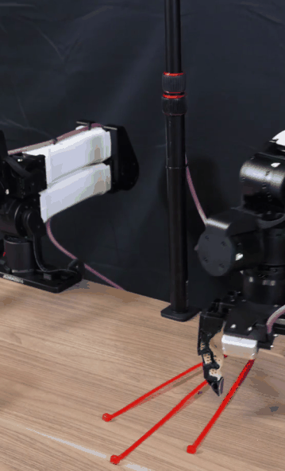
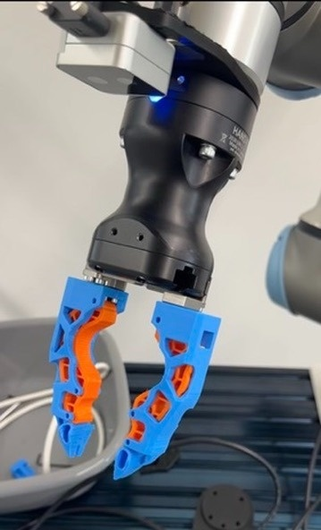
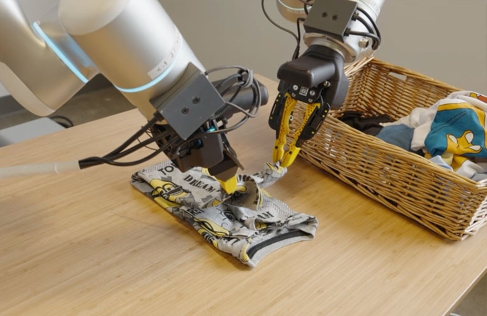
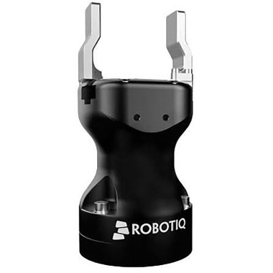
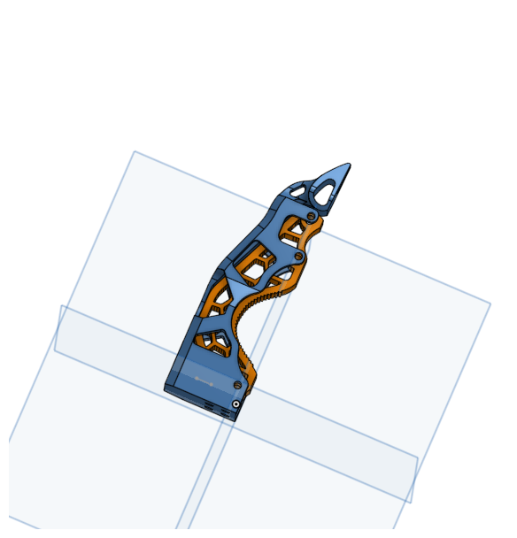
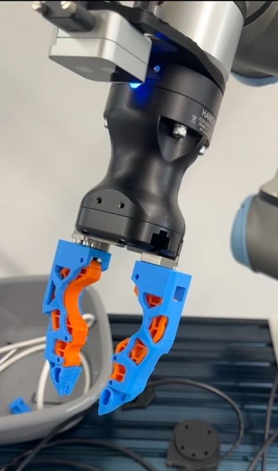

# Open-ENPIRE-Gripper-NVIDIA

<div align="center">

[](https://opensource.org/licenses/Apache-2.0)
[](https://research.nvidia.com/labs/gear/enpire/)
[](https://twitter.com/DrJimFan)
[](https://github.com/pgeedh/Open-ENPIRE-Gripper-nvidia)

### Universal Compliant Gripper (UCG) Adapters for Robot Learning & Physical AI

<br>

<table align="center" border="0">
  <tr>
    <th align="center" width="50%">NVIDIA GEAR ENPIRE Research Video</th>
    <th align="center" width="50%">Robotiq Hand-E Physical Adapter</th>
  </tr>
  <tr>
    <td align="center" valign="top">
      <a href="https://research.nvidia.com/labs/gear/enpire/">
        
      </a>
    </td>
    <td align="center" valign="top">
      
    </td>
  </tr>
</table>

</div>

---

## Purpose & Mission

### Why This Project Exists
In physical AI manipulation research, grasping reliability is fundamentally determined by hardware contact mechanics, including surface friction, passive compliance, and tactile geometry. When NVIDIA's GEAR lab published **ENPIRE** (*Agentic Robot Policy Self-Improvement in the Real World*), co-led by **Dr. Jim Fan** ([@DrJimFan](https://twitter.com/DrJimFan)) and **Dr. Yuke Zhu**, the physical robot achieved remarkable grasping reliability using a custom-engineered 3D-printable finger designed by **Wenli Xiao** (CMU & NVIDIA GEAR) for the **I2RT YAM** robotic arm.

<table align="center" border="0">
  <tr>
    <th align="center" width="50%">Original NVIDIA ENPIRE (I2RT YAM)</th>
    <th align="center" width="50%">Generalist AI (Bimanual Manipulation)</th>
  </tr>
  <tr>
    <td align="center" valign="top">
      
    </td>
    <td align="center" valign="top">
      
    </td>
  </tr>
</table>

However, the I2RT YAM is a specialized research arm that very few universities, startups, independent makers, or robotics labs own.

### The Rise of Universal Compliant Grippers (UCG) in Physical AI
Across the frontier robotics industry, leading physical AI companies and research teams (including **[Generalist AI](https://generalistai.com/blog/research-preview)**, **[Physical Intelligence (Pi)](https://twitter.com/Physical_Int)**, **[Figure AI](https://twitter.com/Figure_robot)**, **[1X Technologies](https://twitter.com/1x_tech)**, **[Skild AI](https://twitter.com/Skild_AI)**, **[Tesla Optimus](https://twitter.com/Tesla_Optimus)**, **[AgileX Robotics](https://twitter.com/AgilexRobotics)**, and **[Toyota Research Institute (TRI)](https://www.tri.global/)**) are converging on a shared thesis: **deploying general-purpose physical AI requires versatile, compliant, high-friction parallel fingertips that can handle diverse, delicate, and high-force interactions without tool-changers**.

We refer to this design paradigm as the **Universal Compliant Gripper (UCG)**.  
*(Note: UCG is not an official industry acronym, but rather our term to describe this class of cross-platform, passively compliant, high-friction parallel hardware).*

### Empowering Modern Robot Learning: $\pi_0$, GR00T, Diffusion Policy, & ACT
State-of-the-art robot learning policies and foundation models require hardware that can absorb physical uncertainty:
* **$\pi_0$ (Pi-Zero by Physical Intelligence)**: Flow-matching / diffusion generalist physical AI model requiring robust non-slip tactile dynamics across complex multi-task domains.
* **GR00T (NVIDIA Generalist Robot 00T)**: Multimodal foundation model driving humanoid and bimanual dexterous manipulation.
* **Diffusion Policy (DP / Chi et al.)**: Visuomotor action diffusion executing high-frequency continuous action trajectories.
* **ACT (Action Chunking with Transformers / Zhao et al.)**: High-frequency bimanual imitation learning powering ALOHA and tabletop learning rigs.
* **OpenVLA, Octo, RT-1 & RT-2**: Vision-Language-Action models mapping tokens to spatial end-effector displacements.

When training these policies, robots encounter an expansive distribution of physical objects: folding delicate fabrics, tensioning flexible zip-ties, sorting thin fasteners, handling micro-pins, and seating rigid PCBs.

The core aim of this project is to deliver a **Universal Compliant Gripper (UCG) finger architecture versatile enough to master this broad spectrum of manipulation tasks** to **enhance the capabilities of existing robot hardware** and **democratize frontier physical AI for everyone**.

In the open-source community, researchers and builders train policies across diverse robotic arms:
* **Robotiq Hand-E**: Precision electric parallel gripper for industrial and research cobots.
* **ALOHA / Mobile ALOHA**: Stanford/Trossen bimanual imitation learning standard.
* **Open Arm**: Accessible open-source robotics platform.
* **AgileX (Piper)**: Lightweight 6-DoF bimanual research arms.
* **Seeed Studio reBot**: Low-cost edge AI vision-language-action (VLA) testbed.
* **Franka Emika Panda / FR3**: 7-DoF contact-physics research standard.
* **Robotiq 2F-85 & 2F-140**: High-payload parallel grippers for Universal Robots, Kinova, and AUBO.
* **ARX5**: Bimanual mobile manipulation arms.

### Mission: Democratizing Frontier Gripper Design
> **Hardware breakthroughs in robotics should not be locked to a single proprietary arm.**
> 
> The mission of **Open-ENPIRE-Gripper-NVIDIA** is to bridge the gap between frontier physical AI research and the global robotics community:
> 1. **Universal Accessibility**: Translate the proven high-friction, compliant contact profile into 3D-printable STL adapters for popular robot arms. All printable models can be found in the [`grippers-stl/`](grippers-stl/) folder.
> 2. **Physical AI for Everyone**: Enable anyone with a standard 3D printer to achieve frontier-grade contact mechanics on their existing robot without purchasing expensive custom end-effectors.
> 3. **Community-Driven Standardization**: Establish this geometry as an open-source standard across all parallel-jaw robotic grippers, starting with our physical adaptation for the **Robotiq Hand-E**.

*Original MakerWorld Project: [Gripper Finger for Robot Arm](https://makerworld.com/en/models/2984746-gripper-finger-for-robot-arm) / [Profile #3349177](https://makerworld.com/en/models/2984746-gripper-finger-for-robot-arm#profileId-3349177) by Wenli Xiao.*

---

## Robotiq Hand-E Universal Compliant Gripper (UCG) Adapter

Our primary physical adaptation mounts the ENPIRE UCG fingertip geometry directly onto the **Robotiq Hand-E** parallel electric gripper:

<table align="center" border="0">
  <tr>
    <th align="center" width="33%">Standard OEM Hand-E</th>
    <th align="center" width="33%">Dual-Material CAD Model</th>
    <th align="center" width="33%">Mounted Hand-E UCG Gripper</th>
  </tr>
  <tr>
    <td align="center" valign="top">
      
    </td>
    <td align="center" valign="top">
      
    </td>
    <td align="center" valign="top">
      
    </td>
  </tr>
</table>

| Parameter | Specification |
| :--- | :--- |
| **Target Directory** | [`grippers-stl/hand_e_stl/`](grippers-stl/hand_e_stl/) |
| **Mounting Interface** | Standard 2× M4 / M3 counterbore bracket per finger |
| **Stroke & Force** | 50 mm linear parallel stroke | 20 N to 130 N programmable grip force |
| **Contact Surface** | Dual-material structural beam with integrated anti-slip compliant friction inserts |

---

## Robot Compatibility Matrix

> 💡 **3D Printable Files**: All different gripper STL models for the supported robotic arms can be found in the [`grippers-stl/`](grippers-stl/) folder.

| Robot Platform | Arm Type / Gripper Interface | Status | Target STL Folder |
| :--- | :--- | :---: | :--- |
| **Robotiq Hand-E** | Precision Electric Parallel Gripper | **Available** | [`grippers-stl/hand_e_stl/`](grippers-stl/hand_e_stl/) |
| **ALOHA / Mobile ALOHA** | ViperX Parallel Jaw Carriage | *In Progress* | [`grippers-stl/aloha_stl/`](grippers-stl/aloha_stl/) |
| **Open Arm** | Modular Open-Source Parallel Mount | *In Progress* | [`grippers-stl/open_arm_stl/`](grippers-stl/open_arm_stl/) |
| **AgileX (Piper)** | Dual Pin + M3 Fastener Slider | *In Progress* | [`grippers-stl/agilex_stl/`](grippers-stl/agilex_stl/) |
| **Seeed Studio reBot** | AI Arm Parallel Gripper Slider | *In Progress* | [`grippers-stl/seeed_rebot_stl/`](grippers-stl/seeed_rebot_stl/) |
| **Robotiq 2F-85 / 2F-140** | 2× M4 Bracket Mount (10 mm spacing) | *In Progress* | [`grippers-stl/robotiq_2f85_2f140_stl/`](grippers-stl/robotiq_2f85_2f140_stl/) |
| **Franka Panda / FR3** | Quick-Mount Dovetail / M4 Slider | *In Progress* | [`grippers-stl/franka_panda_stl/`](grippers-stl/franka_panda_stl/) |
| **ARX5** | Direct Dual Lug M3 Pattern | *In Progress* | [`grippers-stl/arx5_stl/`](grippers-stl/arx5_stl/) |
| **I2RT YAM** | Native Dual M3 Clamp (Wenli Xiao Baseline) | *Baseline* | [`grippers-stl/enpire_i2rt_yam_stl/`](grippers-stl/enpire_i2rt_yam_stl/) |
| **ISO 9409-1 (UR / xArm)** | Universal Tool Flange Adapter Plates | *In Progress* | [`grippers-stl/iso_flange_adapters_stl/`](grippers-stl/iso_flange_adapters_stl/) |

*Status: Available (Ready to print) | In Progress (Community Contributions Welcome)*

---

## 3D Printing Specifications & Tested Slicer Profile

All parts shown were printed and verified on a **Bambu Lab P1S** using **Bambu Studio / OrcaSlicer**.

### 1. Infill Geometry & Wall Parameters (Bambu Lab P1S)
* **Infill Pattern**: **Gyroid** is strongly recommended. Gyroid provides uniform, isotropic load resistance in all axes ($X, Y, Z$), preventing internal shear fracture when the gripper applies peak clamping torque.
* **Infill Density**:
  * **50% – 60% Gyroid** for the rigid structural frame.
  * **30% – 40% Gyroid** for the compliant grip insert (provides elastic compliance to conform around delicate components).
* **Wall Loops / Perimeters**: **5 to 6 walls** (ensures solid M3/M4 mounting hole walls and maximum beam bending stiffness).
* **Top & Bottom Shells**: **5 solid layers** for zero flex at fastener interfaces.

### 2. Support Configuration (Bambu Studio / OrcaSlicer)
* **Support Type**: **Tree (Auto)** / Tree Slim.
* **Threshold Angle**: **35° – 45°**.
* **Top Z Distance**: **0.20 mm** (clean surface separation with zero scarring).
* **Bottom Z Distance**: **0.20 mm**.
* **Support Wall Loops**: **1**.
* **Support Infill**: 15% Grid / Tree Branch.

### 3. Slicer Parameter Table

| Parameter | Rigid Frame (PETG-CF / PA-CF) | Compliant Grip Core (TPU 85A/95A) |
| :--- | :--- | :--- |
| **Tested Machine** | **Bambu Lab P1S** | **Bambu Lab P1S** |
| **Layer Height** | **0.16 mm** (Optimal for screw counterbores) | **0.16 mm – 0.20 mm** |
| **Wall Loops** | **5 – 6 walls** (Critical for strength) | **4 walls** |
| **Infill Pattern** | **Gyroid (50% – 60%)** | **Gyroid (30% – 40%)** |
| **Nozzle Temp** | 255°C (PETG-CF) / 285°C (PA-CF) | 225°C – 235°C (TPU) |
| **Bed Temp** | 70°C – 80°C (Textured PEI Plate) | 45°C – 55°C (Engineering Plate) |
| **Print Speed** | 80 – 160 mm/s | 20 – 35 mm/s (Slow for TPU flow) |
| **Supports** | Tree Auto (40° threshold, 0.2mm Top-Z) | None needed |

### 4. Hardware Assembly & Fastener Notes
* **Heat-Set Brass Inserts**: Press M3/M4 threaded inserts flush into mounting pockets using a soldering iron set to **230°C** for PETG/PLA or **275°C** for PA-CF.
* **Fasteners**: Use ISO 4762 Grade 12.9 M3/M4 socket head cap screws with medium blue threadlocker (Loctite 243) to prevent vibration-induced loosening.

---

## URDF Simulation Models & STL Automation

We provide an automated script in `scripts/generate_urdf_from_stl.py` that parses any pair of finger STL files from [`grippers-stl/`](grippers-stl/), calculates center-of-mass, inertia, scales from millimeters to meters, and outputs a physics-ready **URDF** for **NVIDIA Isaac Sim, MuJoCo, PyBullet, and ROS 2**:

```bash
# Generate a URDF from your STL files:
python3 scripts/generate_urdf_from_stl.py \
  --name hand_e_enpire_gripper \
  --left_stl grippers-stl/hand_e_stl/hand_e_enpire_finger_left.stl \
  --right_stl grippers-stl/hand_e_stl/hand_e_enpire_finger_right.stl \
  --stroke_mm 50.0 \
  --force_n 130.0 \
  --out hand_e_enpire_gripper.urdf
```

---

## Rules for Contributing

1. **Watertight Mesh**: Export binary STL files in **Millimeters (mm)** with zero non-manifold edges. Verify using:
   ```bash
   python3 scripts/validate_mesh.py
   ```
2. **Standard Orientation**: Coordinate frames must align ($+Z$ finger length, $+Y$ inward contact face). Export oriented flat on its side.
3. **Physical Test Print Required**: You must physically print the part and verify full stroke closure without binding before submitting a PR.
4. **PR Checklist**: Attach clear photos of the 3D-printed part installed on your robot arm and list your slicer settings.

*See [CONTRIBUTING.md](CONTRIBUTING.md) for full guidelines.*

---

## Citation & Attribution

If you use this gripper design or its multi-arm adapters in your research, please cite both the foundational ENPIRE paper and this open-source hardware project:

### 1. Foundational ENPIRE Research Paper
```bibtex
@article{xiao2024enpire,
  title={ENPIRE: Agentic Robot Policy Self-Improvement in the Real World},
  author={Xiao, Wenli and Fan, Linxi and Zhu, Yuke and GEAR Lab and Collaborators},
  journal={arXiv preprint},
  year={2024}
}
```

### 2. Open-ENPIRE-Gripper-NVIDIA Repository & Design Adaptation
```bibtex
@misc{open_enpire_gripper_2026,
  title={Open-ENPIRE-Gripper-NVIDIA: Universal Compliant Gripper (UCG) Adapters for Robot Learning and Physical AI},
  author={Geedh, Pruthvi Omkar and Open Source Robotics Community},
  howpublished={\url{https://github.com/pgeedh/Open-ENPIRE-Gripper-nvidia}},
  year={2026}
}
```

*Foundational fingertip design by **Wenli Xiao** (CMU / NVIDIA GEAR) via [MakerWorld #3349177](https://makerworld.com/en/models/2984746-gripper-finger-for-robot-arm). Research led by **Dr. Jim Fan** ([@DrJimFan](https://twitter.com/DrJimFan)) & **Dr. Yuke Zhu**.*

---

## License

Licensed under the [Apache License, Version 2.0](LICENSE).
