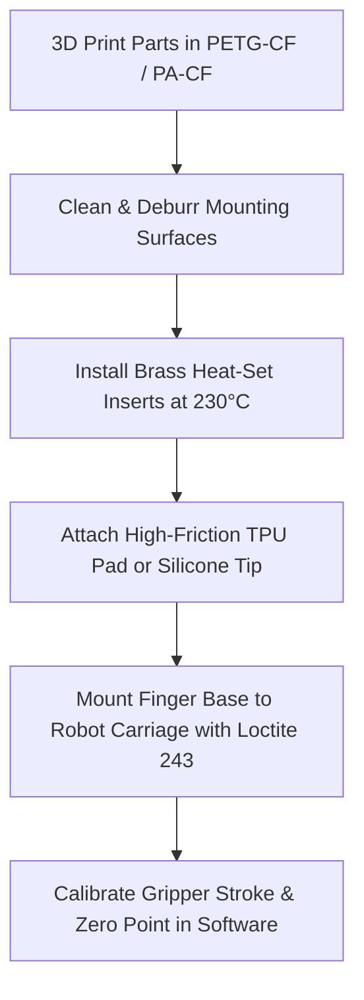

# Step-by-Step Assembly Guide

This guide walks through assembling and mounting the **ENPIRE Gripper** fingers to your robot arm.

---

## Prerequisites
- 3D-printed finger components (from `stl/`)
- M3/M4 fasteners and brass heat-set inserts (from [HARDWARE_BOM.md](file:///docs/HARDWARE_BOM.md))
- Soldering iron + hex key set + Loctite 243

---

## Assembly Workflow

---

### Step 1: Heat-Set Insert Installation
1. Locate the cylindrical insert pockets on the back of the finger mounting block.
2. Preheat your soldering iron to **230°C** (PETG/PLA) or **275°C** (Nylon/PA).
3. Place an M3 brass threaded insert squarely over the hole.
4. Press the iron tip down gently. The insert will melt into the plastic.
5. Once the insert sits **0.2mm below flush**, withdraw the iron and press the top flat with a cold steel block or ruler.
6. Repeat for all 4 mounting holes.

### Step 2: Installing Grip Friction Surfaces
- **Option A (Modular Snap-In TPU Pad)**: Press `tpu_snap_pad_standard.stl` or `tpu_snap_pad_ridged.stl` firmly into the front slot until both retention tabs click into position.
- **Option B (Cast Silicone Tip)**: Pour mixed Smooth-On Dragon Skin 20 into `silicone_mold_finger_cavity.stl`, insert the core lid, and allow to cure for 4 hours. Demold and adhere to the finger face using Sil-Poxy adhesive.

### Step 3: Mounting to Robot Slider Carriage
1. Align the finger mounting holes with the robot arm's parallel jaw slider.
2. Apply a drop of medium-strength blue threadlocker (Loctite 243) to each M3 (or M4) socket head cap screw.
3. Tighten fasteners in an alternating diagonal pattern to **1.2 Nm** (M3) or **2.5 Nm** (M4).
4. Verify that both fingers are aligned and parallel along the full closing stroke.

### Step 4: Software Stroke Zeroing & Calibration
- Move the gripper to full closure slowly at low torque limit ($\le 10\text{ N}$).
- Verify that fingertip contact faces touch evenly across their entire area without binding or twisting.
- Set the closed position as $0.0\text{ mm}$ and open limit to rated stroke (e.g., $80.0\text{ mm}$).
