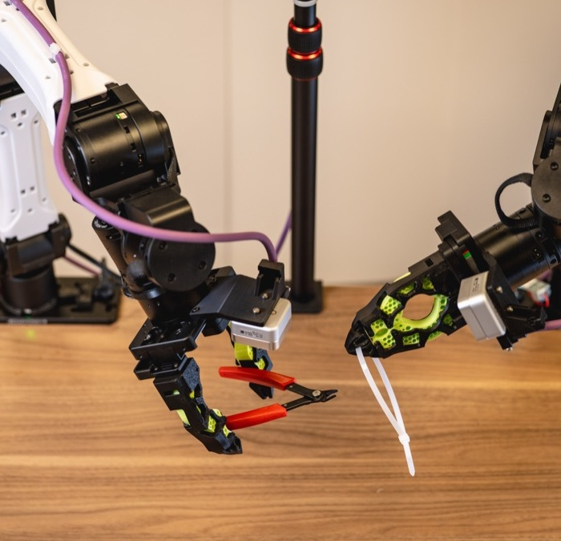

# I2RT YAM Baseline ENPIRE Gripper Models

### Foundational 3D-Printable Compliant Finger Architecture by Wenli Xiao (CMU / NVIDIA GEAR)

 

 
<em>Original ENPIRE compliant finger design in action on the I2RT YAM research arm (NVIDIA GEAR Lab).</em>

---

## Overview

This directory houses the baseline documentation and reference models for the foundational **I2RT YAM** robotic arm gripper fingers originally created by **Wenli Xiao** (CMU & NVIDIA GEAR Lab) for the **NVIDIA ENPIRE** project (*Agentic Robot Policy Self-Improvement in the Real World*).

---

## 🔗 Official MakerWorld Sources
* 🌐 **MakerWorld Model Page**: [Gripper Finger for Robot Arm (Model #2984746)](https://makerworld.com/en/models/2984746-gripper-finger-for-robot-arm)
* 👤 **Designer Profile**: [Wenli Xiao (Profile #3349177)](https://makerworld.com/en/models/2984746-gripper-finger-for-robot-arm#profileId-3349177)
* 📄 **Research Paper**: [ENPIRE: Agentic Robot Policy Self-Improvement in the Real World](https://research.nvidia.com/labs/gear/enpire/)

---

## 📦 Production-Ready STL Models

* **`i2rt_UCG_Hard.stl`** — Primary rigid structural frame adapter for I2RT YAM arms (print in PETG-CF / PA-CF / PLA-CF).
* **`I2RT_UCG_Soft.stl`** — Compliant high-friction tactile grip insert (print in TPU 85A / TPU 95A).

---

## 📐 Mechanical Specifications (I2RT YAM Platform)

| Parameter | Specification |
| :--- | :--- |
| **Robot Arm Platform** | **I2RT YAM** Research Arm |
| **Mounting Interface** | Dual M3 clamping bolt pattern |
| **Finger Style** | Compliant high-friction curved parallel finger (Dual-material) |
| **Frame Dimensions (Hard)** | 31.6 mm × 114.9 mm × 32.6 mm |
| **Insert Dimensions (Soft)** | 15.0 mm × 81.0 mm × 29.8 mm |
| **Materials** | Dual-material: Rigid skeleton (PETG/PA-CF) + Compliant core (TPU 85A/95A) |
| **Primary Tasks** | High-precision pin insertion, zip-tie manipulation, GPU seating, USB plug insertion |

---

## 🖨️ Recommended 3D Printing Settings (Bambu Lab P1S)

* **Body (Rigid Frame `i2rt_UCG_Hard.stl`)**: PETG-CF / PA-CF, 0.16 mm layer height, 5–6 walls, 50% Gyroid infill
* **Grip Pad (Compliant Core `I2RT_UCG_Soft.stl`)**: TPU 85A or TPU 95A, 0.16 mm layer height, 4 walls, 30% Gyroid infill
* **Supports**: Tree (Auto), 40° threshold angle, 0.20 mm Top Z distance
