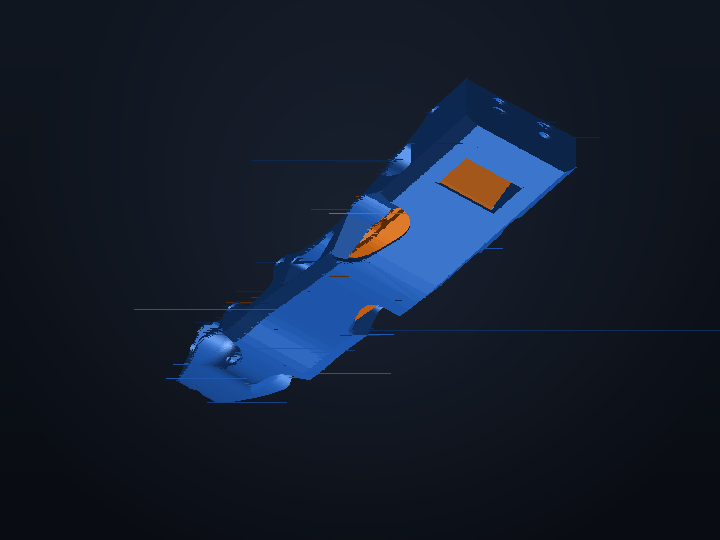

# Robotiq Hand-E Universal Compliant Gripper (UCG)

### Transforming the Standard Industrial Robotiq Hand-E into a Frontier High-Friction Compliant Gripper for Robot Learning & Physical AI

 

<table align="center" border="0">
  <tr>
    <th align="center" width="33%">Standard OEM Robotiq Hand-E</th>
    <th align="center" width="33%">Physical Hand-E + ENPIRE Fingers</th>
    <th align="center" width="33%">3D Dual-Material CAD Render</th>
  </tr>
  <tr>
    <td align="center" valign="top">
      
    </td>
    <td align="center" valign="top">
      
    </td>
    <td align="center" valign="top">
      
    </td>
  </tr>
</table>

---

## 🔗 Official Hardware Reference
* 🌐 **Official Product Page**: [Robotiq Hand-E Adaptive Robot Gripper](https://robotiq.com/products/hand-e-adaptive-robot-gripper)
* 📖 **Robotiq Support & Manuals**: [support.robotiq.com](https://support.robotiq.com)

---

## 📦 Production-Ready STL Files

This directory contains the production-ready **3D-printable binary STL files** for mounting the ENPIRE Universal Compliant Gripper (UCG) fingertip geometry directly onto the **Robotiq Hand-E** electric parallel gripper:

* **`Robotiq_UCG_Hard_Hand_E.stl`** — Primary rigid structural skeleton adapter (print in PETG-CF / PA-CF / PLA-CF)
* **`Robotiq_UCG_Soft_Hand_E.stl`** — Compliant high-friction tactile grip insert (print in TPU 85A / TPU 95A)

---

## 📐 Mechanical Specifications

| Parameter | Specification |
| :--- | :--- |
| **Gripper Platform** | [**Robotiq Hand-E**](https://robotiq.com/products/hand-e-adaptive-robot-gripper) (Linear Parallel Stroke) |
| **Finger Design Paradigm** | **Universal Compliant Gripper (UCG)** |
| **Mounting Fasteners** | 2× M4 / M3 socket head cap screws per finger |
| **Fastener Spacing** | Standard Robotiq 10 mm PCD pattern |
| **Frame Dimensions (Hard)** | 28.9 mm × 109.5 mm × 32.6 mm |
| **Insert Dimensions (Soft)** | 15.0 mm × 81.0 mm × 29.8 mm |
| **Linear Stroke** | 50.0 mm parallel travel |
| **Programmable Clamping Force** | 20 N to 130 N |
| **Contact Surface** | Dual-material rigid backbone with ribbed compliant high-friction core ($\mu > 0.8$) |

---

## 🖨️ Tested 3D Printing Profile (Bambu Lab P1S)

* **Materials**:
  * **Outer Rigid Backbone (`Robotiq_UCG_Hard_Hand_E.stl`)**: **PETG-CF**, **PLA-CF**, or **PA12-CF (Nylon-CF)** (Blue)
  * **Compliant Friction Core (`Robotiq_UCG_Soft_Hand_E.stl`)**: **TPU 85A** or **TPU 95A** (Orange)
* **Layer Height**: **0.16 mm** (Optimal for screw counterbores and tooth engagement)
* **Wall Loops / Perimeters**: **5 to 6 walls** (Critical for bolt clamp strength)
* **Infill Pattern & Density**: **50% – 60% Gyroid** (Rigid frame) / **30% – 40% Gyroid** (TPU core)
* **Support Configuration**: Tree (Auto), 40° threshold, **0.20 mm Top Z distance**
