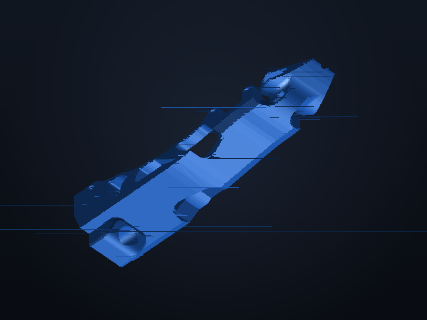

# Robotiq 2F-85 / 2F-140 Universal Compliant Gripper (UCG) STL Models

### Transforming Heavy-Duty Robotiq 2-Finger Adaptive Grippers for Physical AI Manipulation & Policy Self-Improvement

 

 
<em>Heavy-duty Robotiq 2F-140 Universal Compliant Gripper (UCG) finger adapter (Robotiq_2F-140-UCG_Hard.stl).</em>

---

## Overview

This directory contains production-ready 3D-printable binary STL files for mounting the **Universal Compliant Gripper (UCG)** geometry onto **Robotiq 2F-85** and **Robotiq 2F-140** adaptive robot grippers.

The Robotiq 2F series is one of the most widely deployed industrial parallel end-effectors on Universal Robots (UR3e/UR5e/UR10e/UR16e), Kinova, and AUBO arms. Upgrading the standard rigid aluminum fingers to the ENPIRE compliant high-friction profile enables reliable non-slip grasping across challenging objects (micro-pins, flexible zip-ties, PCB connectors, cables, and delicate glassware) without dropping parts or requiring complex force-torque feedback loops.

---

## 🔗 Official Hardware References
* 🌐 **Official Product Page**: [Robotiq 2F-85 & 2F-140 Adaptive Robot Grippers](https://robotiq.com/products/2f85-140-adaptive-robot-gripper)
* 📖 **Robotiq Documentation**: [support.robotiq.com](https://support.robotiq.com)

---

## 📦 Production-Ready STL Models

* **`Robotiq_2F-140-UCG_Hard.stl`** — High-strength rigid structural adapter finger for Robotiq 2F-140 (and 2F-85 bracket interfaces), optimized for high clamping forces (up to 235 N).
* **`Robotiq_2F-140-UCG_soft.stl`** — Compliant high-friction tactile grip insert (print in TPU 85A / TPU 95A).

---

## 📐 Mechanical Specifications

| Parameter | Specification |
| :--- | :--- |
| **Gripper Models** | [**Robotiq 2F-140**](https://robotiq.com/products/2f85-140-adaptive-robot-gripper) (140mm stroke) / **Robotiq 2F-85** (85mm stroke) |
| **Finger Design Paradigm** | **Universal Compliant Gripper (UCG)** High-Friction Parallel Jaw |
| **Mounting Interface** | 2× M4 socket head cap screws (standard 10 mm center spacing) |
| **Overall Length ($+Y$)** | 107.4 mm |
| **Base Width ($+X$)** | 28.9 mm |
| **Depth ($+Z$)** | 45.4 mm |
| **Linear Stroke Range** | 85.0 mm (2F-85) to 140.0 mm (2F-140) |
| **Maximum Grip Force** | Up to 235 N |
| **Materials** | Dual-material: Rigid skeleton (PETG/PA-CF) + Compliant core (TPU 85A/95A) |
| **Best Applications** | Industrial pick-and-place, machine tending, high-payload robot learning, bimanual assembly |

---

## 🖨️ Tested 3D Printing Profile (Bambu Lab P1S)

* **Body (Rigid Frame `Robotiq_2F-140-UCG_Hard.stl`)**:
  * **Filament**: **PETG-CF**, **PA12-CF (Nylon-CF)**, or **PLA-CF**
  * **Layer Height**: **0.16 mm** (Ensures clean M4 counterbore seating and fine tooth detail)
  * **Wall Loops / Perimeters**: **5 to 6 walls** (Critical for bearing 235 N clamping forces)
  * **Infill Pattern & Density**: **50% – 60% Gyroid** (Isotropic stress distribution)
  * **Support Configuration**: Tree (Auto), 40° threshold, **0.20 mm Top Z distance**
* **Grip Pad (Compliant Core `Robotiq_2F-140-UCG_soft.stl`)**:
  * **Filament**: **TPU 85A** or **TPU 95A**
  * **Layer Height**: **0.16 mm – 0.20 mm**
  * **Wall Loops**: **4 walls**
  * **Infill Pattern & Density**: **30% – 40% Gyroid**
  * **Supports**: None needed

---

## 🤝 Community Contributions

> 💡 **Have an additional variation?** If you have designed an extended thin-pinch variant or alternate mounting bracket for Robotiq 2F grippers, feel free to **[submit a Pull Request](https://github.com/pgeedh/Open-ENPIRE-Gripper-nvidia/pulls)** following our [Rules for Contributing](../../CONTRIBUTING.md).
